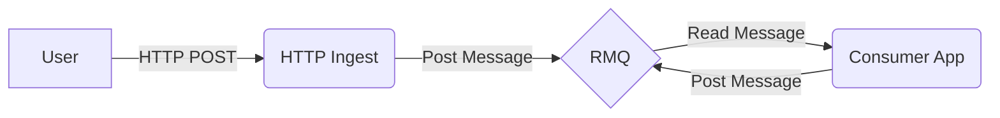

# Java Message Streams

Demonstrates one or more open source frameworks by building a set of microservices for message stream processing. Focuses primiarily on [RabbitMQ][rabbitmq] but ideally another messaging platform, such as [Apache Kafka][kafka], could be easily swapped in.

Requirements:

- Open source framework with minimal (if any) changes or customization required
- Minimal boiler plate
- Allows various message encoding options (json, thrift, protobuf)
- Has some form of failed message handling (dead letter exchanges)
- Simple to scale (ie. more app instances -> more messages processed per second)
- Configurable via environment variables or configuration file
- Can detect when when no consumer is configured (messages are not lost to ether)

**General Flow**

# Implementations

## [Spring Cloud][spring cloud]

<!-- Links -->

[rabbitmq]: https://www.rabbitmq.com/ "RabbitMQ"
[kafka]: https://kafka.apache.org/ "Apache Kafka"
[spring cloud]: https://spring.io/projects/spring-cloud "Spring Cloud"
