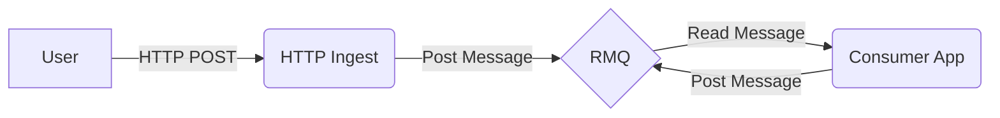

# Java Message Streams

Demonstrates one or more open source frameworks by building a set of microservices for message stream processing. Focuses primiarily on [RabbitMQ][rabbitmq] but ideally another messaging platform, such as [Apache Kafka][kafka], could be easily swapped in.

Requirements:

- Open source framework with minimal (if any) changes or customization required
- Minimal boiler plate
- Allows various message encoding options (json, thrift, protobuf)
- Has some form of failed message handling (dead letter exchanges)
- Simple to scale (ie. more app instances -> more messages processed per second)
- Configurable via environment variables or configuration file
- Can detect when when no consumer is configured (messages are not lost to ether)
- Easy to add distributed tracing
- Quorum and non-quorum queues

TODO:

- What if there is no binding on an exchange?

**General Flow**

# Implementations

## [Spring Boot][spring boot] + [Spring Cloud][spring cloud]

### Demo

1. Start the infrastructure dependencies with `docker-compose up`
1. Start `http-sink` with `cd http-sink && ../gradlew bootRun`
1. Start `stream-rabbit` with `cd stream-rabbit && ../gradlew bootRun`
1. Send a valid message: `curl -X POST http://localhost:8080/ -H 'Content-Type: application/json' -d '{"name":"paul"}'`
   1. Message should proccess through both apps successfully
1. Send a bad message: `curl -X POST http://localhost:8080/ -H 'Content-Type: application/json' -d '{"id":"123-456"}'`
   1. Message will process through `http-sink`
   1. `rabbit-stream` will throw an `IllegalArgumentException` because `name` is missing
   1. `rabbit-stream` will retry the message 2 additional times with increasing delay before finally sending it to a DLQ

- See Message traffic in RMQ UI: http://localhost:15672/
- See Jaeger tracing info in Jaeger UI: http://localhost:16686/search

[Alternate DLQ Strategy](https://github.com/spring-cloud/spring-cloud-stream-binder-rabbit#retry-with-the-rabbitmq-binder) which will send failures to a DLX for a set delay before placing them back on the queue

[Publisher Confirms and Returns](https://github.com/spring-cloud/spring-cloud-stream-binder-rabbit#retry-with-the-rabbitmq-binder) details how to handle cases where no binding on the exchange exists (messages normally dropped).

<!-- Links -->

[rabbitmq]: https://www.rabbitmq.com/ "RabbitMQ"
[kafka]: https://kafka.apache.org/ "Apache Kafka"
[spring boot]: https://spring.io/projects/spring-boot "Spring Boot"
[spring cloud]: https://spring.io/projects/spring-cloud "Spring Cloud"
